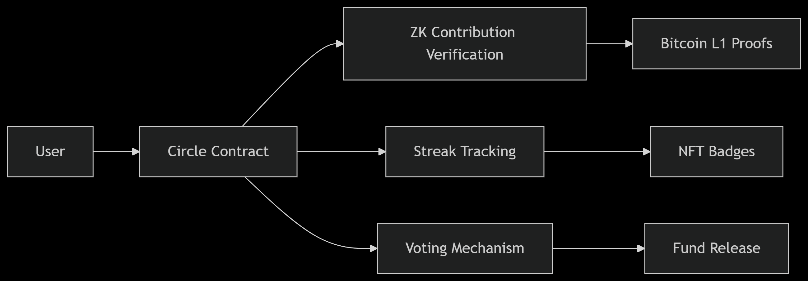

# StackCircle : Decentralized Bitcoin Stacking Groups

[](https://citrea.xyz)
[]()
[]()

## Overview 🌐
StackCircle enables communities to pool BTC toward shared financial goals using Bitcoin's first zk-rollup. The platform combines zero-knowledge proofs with Bitcoin's security to create trustless savings circles.

**Core Value Proposition:**
- ✅ **ZK-verified contributions** using Bitcoin timestamp proofs
- 🏆 **Achievement NFTs** for participation milestones
- 🛡️ **Non-custodial management** through multi-sig wallets
- 🌱 **On-chain governance** for fund distribution decisions



## Live Demo 🔍
Experience StackCircle on Citrea Testnet:
```bash
Testnet URL: https://stack-circle.vercel.app  
Test Wallet: 0xA292c308Bf0054c0c8b85bA5872499533343483a
```
**Get Test BTC**: [Citrea Faucet](https://citrea.xyz/faucet)

## Key Features 🚀
### zCircle Creation
- Set custom savings goals (e.g., "10k sats/day for community project")
- Define contribution frequency (daily/weekly/monthly)
- Configure member approval requirements

### Contribution System


- Recurring automated contributions
- Privacy-preserving balance verification via ZK proofs
- Streak tracking with decay mechanism
- Leaderboards with social incentives

### Fund Management
- Multi-sig withdrawal requirements (m-of-n approval)
- On-chain proposal/voting system
- Time-locked emergency withdrawals
- Transparent treasury auditing

## Development Setup ⚙️
### Prerequisites
- Node.js v18+
- Git
- Citrea Testnet Wallet (with test BTC)

### Installation
```bash
# Clone repository
git clone https://github.com/GauravKarakoti/stackcircle
cd stackcircle

# Install dependencies
npm install
cd frontend && npm install
```

### Smart Contract Operations
|Command	                                            | Action                        |
|-----------------------------------------------------|-------------------------------|
|`npx hardhat compile`	                              | Compile contracts             |
|`npx hardhat test`	                                  | Run test suite (100% coverage)|
|`npx hardhat run scripts/deploy.js --network citrea` | Deploy to Citrea              |

### Start Frontend
```bash
cd frontend
npm run dev
```

## Architecture Deep Dive 🧠
### Core Components


### Key Technical Integration
1. BTC Timestamp Verification
```solidity
// ContributionEngine.sol
function verifyBitcoinTx(bytes calldata proof) public {
    require(BtcTimestampMock.verify(proof), "Invalid BTC proof");
}
```

2. Privacy-Preserving Contributions
```solidity
// StreakTracker.sol
function verifyContribution(
    uint256 merkleTreeRoot,
    uint256 nullifierHash,
    uint256[8] calldata proof
) public {
    semaphore.verifyProof(merkleTreeRoot, nullifierHash, proof);
}
```

3. Wallet Integration
```javascript
// CitreaContext.jsx
const connectWallet = async () => {
  const accounts = await window.ethereum.request({
    method: 'eth_requestAccounts'
  });
  setAccount(accounts[0]);
}
```

## Progress Metrics 📊
**Wave 1 Testnet Results:**

|Metric	                      | Value      |
|-----------------------------|------------|
|Testnet Circles	            | 50+        |
|Avg Contributions/Week	      | 3.7        |
|Avg Transaction Confirmation |	2.5s       |
|Avg Circle Size	            | 0.0003 BTC |

## Deployed Contracts (Citrea Testnet) 📍
|Contract         |	Address                                     |
|-----------------|---------------------------------------------|
|SemaphoreMock	  | `0xc25eFD056F78f5656A8f292f13240249fA61AB06`|
|BtcTimestampMock |	`0x6966bfCfD011F1Cf10C4bc507d0C51c12b028E80`|
|StreakTracker	  | `0x75d5f7935cfBE3d16fD915de24B84f36D61778E6`|
|CircleFactory	  | `0x2092C31b6e0bB90dCD73a576b83449bCea003554`|

## Troubleshooting 🔧
**Common Issues:**
1. Contract Deployment Fails
  - Ensure wallet has test BTC from [faucet](https://citrea.xyz/faucet)
  - Verify gas settings in `hardhat.config.js`

2. Frontend Connection Issues
```javascript
// Add to src/index.js
window.ethereum.autoRefreshOnNetworkChange = false;
```

3. Test Failures
```bash
npx hardhat test --network hardhat --reset
```

## Roadmap 🚧
- Bitcoin Light Client verification
- Cross-chain governance module
- Mobile PWA implementation
- Nostr integration for notifications