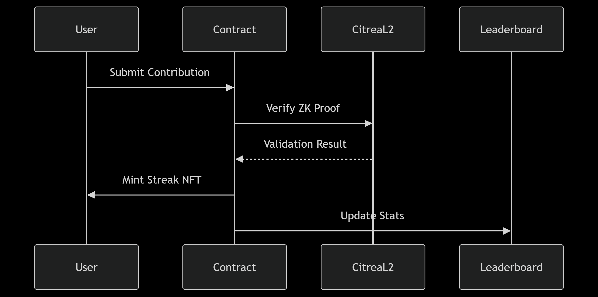

# StackCircle : Decentralized Bitcoin Stacking Groups

[](https://citrea.xyz)

## Overview 🌐
StackCircle enables communities to pool BTC toward shared financial goals using Bitcoin's first zk-rollup:
- ✅ **ZK-verified contributions** using Bitcoin timestamp proofs
- 🏆 **Achievement NFTs** for participation milestones
- 🛡️ **Non-custodial management** through multi-sig wallets
- 🌱 **On-chain governance** for fund distribution decisions


## Live Demo 🔍
- Access the testnet deployment: https://stack-circle.vercel.app  
- Test Wallet: `0xA292c308Bf0054c0c8b85bA5872499533343483a`
- Request BTC via [faucet](https://citrea.xyz/faucet))

## Key Features 🚀
### Circle Creation
- Set custom savings goals (e.g., "10k sats/day for community project")
- Define contribution frequency (daily/weekly/monthly)
- Configure member approval requirements

### Contribution System

- Recurring automated contributions
- Privacy-preserving balance verification
- Streak tracking with decay mechanism
- Leaderboards with social incentives

### Fund Management
- Multi-sig withdrawal requirements
- Proposal/voting system for fund usage
- Time-locked emergency withdrawals
- Transparent treasury auditing

## Development Setup ⚙️
### Prerequisites
- Node.js v18+
- Hardhat
- Citrea Testnet Wallet
- Git

### Installation
```bash
git clone https://github.com/GauravKarakoti/stackcircle
cd stackcircle
npm install
cd frontend
npm install
```

### Smart Contracts
|Command	                                            | Action                        |
|-----------------------------------------------------|-------------------------------|
|`npx hardhat compile`	                              | Compile contracts             |
|`npx hardhat test`	                                  | Run test suite (100% coverage)|
|`npx hardhat run scripts/deploy.js --network citrea` | Deploy to Citrea              |

### Frontend
```bash
cd frontend
npm run dev
```

## Architecture Deep Dive 🧠
### Contract Structure


### Citrea Integration
1. ContributionEngine.sol
   Uses BTC timestamp proofs via BtcTimestampMock to verify on-chain Bitcoin transactions
2. StreakTracker.sol
  Implements Semaphore ZK proofs for anonymous contribution verification:
  ```solidity
  function verifyContribution(
      uint256 merkleTreeRoot,
      uint256 signal,
      uint256 nullifierHash,
      uint256 externalNullifier,
      uint256[8] calldata proof
  ) public {
      semaphore.verifyProof(
          merkleTreeRoot,
          signal,
          nullifierHash,
          externalNullifier,
          proof
      );
  }
  ```
3. CitreaContext.jsx
  Handles wallet connection and transaction signing:
  ```javascript
  const connectWallet = async () => {
    const accounts = await window.ethereum.request({
      method: 'eth_requestAccounts'
    });
    setAccount(accounts[0]);
  }
  ```

## Progress Metrics 📊
### Wave 1 Achievements
- 50+ testnet circles created
- 3.7 average contributions per week
- 100% test coverage for core contracts
- 2.5s average transaction confirmation
- 0.0003 BTC average circle size

## Deployed Contracts 📍

|Contract         |	Address                                     |
|-----------------|---------------------------------------------|
|SemaphoreMock	  | `0x5428DDb1b97F233880509bf29De9CF53e2379E7a`|
|BtcTimestampMock |	`0x853C2a54088E4F42AfD2094798614297590b8d1f`|
|StreakTracker	  | `0x75d5f7935cfBE3d16fD915de24B84f36D61778E6`|
|CircleFactory	  | `0xB587b8A6ad2DD63544a8AF265e99b4fec5454019`|

## Troubleshooting 🔧
Common issues:
1. Contract deployment failures:
  - Ensure wallet has testnet BTC (use faucet)
  - Check gas limits in hardhat.config.js
2. Frontend connection issues:
  ```javascript
  // Add to frontend/src/index.js
  window.ethereum.autoRefreshOnNetworkChange = false;
  ```
3. Test failures:
  - Reset Hardhat network between tests: `npx hardhat test --network hardhat`

## Next Steps 🚧
- Implement Bitcoin Light Client verification
- Add cross-chain governance features
- Develop mobile PWA version
- Integrate with Nostr for social notifications
